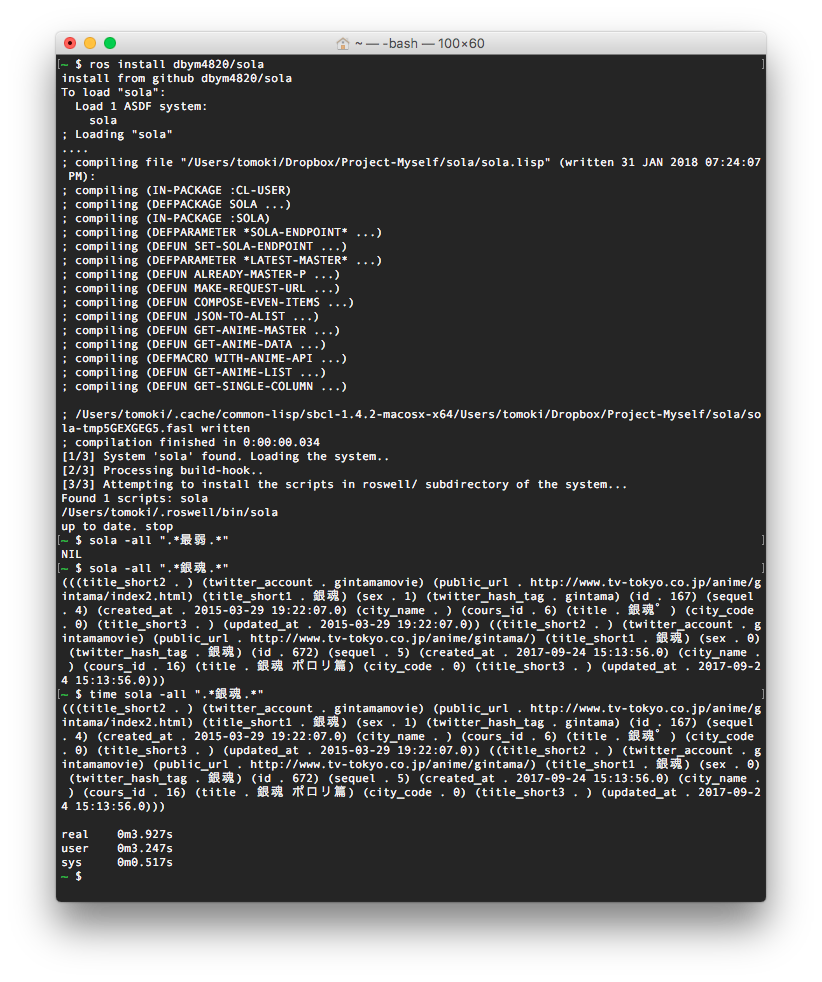

# SOLA: Common Lisp ShangriLa Anime API Library




# What is SOLA?
Common Lisp API for [ShangriLa-ANIME-API](https://github.com/Project-ShangriLa) which is Japanese ANIME Datastore

You can find following types of anime data
- title: ANIME title
- title_short1 and title_short2: Abbreviation of anime title
- public_url: URL of anime official Web site
- sex: For men or for wemen
- sequel: round of anime, 2nd season, 3rd season ...etc
- twitter_account: Official twitter account
- city_name: Name of the city where the stage of the animation


# Requirement

- [roswell](https://github.com/roswell/roswell)
- [homebrew](https://github.com/Homebrew/brew) or [linuxbrew](https://github.com/Linuxbrew/brew)


# Installation

See [roswell](https://github.com/roswell/roswell)

```
# For MacOS
$ brew install roswell

# For Linux
# Install linuxbrew at first and ensure to make path to linuxbrew
$ brew install roswell
```

```
? ros install dbym4820/sola
```

# Usage on Common Lisp REPL (or Program Source Files)

```
CL-USER> (sola:get-anime-list "title" ".*冴え.*")
(((:|title_short2| . "") (:|twitter_account| . "saenai_heroine") (:|public_url| . "http://www.saenai.tv/") (:|title_short1| . "冴えカノ") (:|sex| . 0) (:|twitter_hash_tag| . "saekano") (:|id| . 126) (:|sequel| . 0) (:|created_at| . "2015-01-08 09:37:01.0") (:|city_name| . "") (:|cours_id| . 5) (:|title| . "冴えない彼女の育てかた") (:|city_code| . 0) (:|title_short3| . "") (:|updated_at| . "2015-01-08 09:37:01.0")) ((:|title_short2| . "冴えカノ") (:|twitter_account| . "saenai_heroine") (:|public_url| . "http://www.saenai.tv/") (:|title_short1| . "冴えない彼女の育てかた") (:|sex| . 0) (:|twitter_hash_tag| . "冴えカノ") (:|id| . 556) (:|sequel| . 2) (:|created_at| . "2017-03-20 18:36:15.0") (:|city_name| . "") (:|cours_id| . 14) (:|title| . "冴えない彼女の育てかた♭") (:|city_code| . 0) (:|title_short3| . "") (:|updated_at| . "2017-03-20 18:36:15.0")))

CL-USER> (sola:with-anime-api anime-data ()
	          (format nil "~A" anime-data))
			  ・
			  ・
			  ・
			  ・
```


# Usage on shell

```
? sola --all ".*銀.*"
(((title_short2 . ) (twitter_account . ezono_official) (public_url . http://www.ginsaji-anime.com) (title_short1 . 銀の匙) (sex . 0) (twitter_hash_tag . ginsaji_anime) (id . 19) (sequel . 0) (created_at . 2014-02-02 13:17:17.0) (city_name . ) (cours_id . 1) (title . 銀の匙 Silver Spoon) (city_code . 0) (title_short3 . ) (updated_at . 2014-02-02 13:17:17.0)) ((title_short2 . ) (twitter_account . gintamamovie) (public_url . http://www.tv-tokyo.co.jp/anime/gintama/index2.html) (title_short1 . 銀魂) (sex . 1) (twitter_hash_tag . gintama) (id . 167) (sequel . 4) (created_at . 2015-03-29 19:22:07.0) (city_name . ) (cours_id . 6) (title . 銀魂゜) (city_code . 0) (title_short3 . ) (updated_at . 2015-03-29 19:22:07.0)) ((title_short2 . ) (twitter_account . gintamamovie) (public_url . http://www.tv-tokyo.co.jp/anime/gintama/) (title_short1 . 銀魂) (sex . 0) (twitter_hash_tag . 銀魂) (id . 672) (sequel . 5) (created_at . 2017-09-24 15:13:56.0) (city_name . ) (cours_id . 16) (title . 銀魂 ポロリ篇) (city_code . 0) (title_short3 . ) (updated_at . 2017-09-24 15:13:56.0)) ((title_short2 . ) (twitter_account . ginno_guardian) (public_url . http://ginno-guardian.jp/) (title_short1 . 銀の墓守り) (sex . 0) (twitter_hash_tag . 銀の墓守り) (id . 718) (sequel . 2) (created_at . 2018-01-07 20:29:38.0) (city_name . ) (cours_id . 17) (title . 銀の墓守り(ガーディアン) 第2期) (city_code . 0) (title_short3 . ) (updated_at . 2018-01-07 20:29:38.0)))

? sola --title ".*銀.*" title
(銀の匙 Silver Spoon 銀魂゜ 銀魂 ポロリ篇 銀の墓守り(ガーディアン) 第2期)

```


# Options

## get-anime-list

**Search anime data-set which fit into the argument selector from anime master**

```
(sola:get-anime-list <option-key> <search-query>)
```

Detail is described below

- title | title_short1 | title_short2

```
(sola:get-anime-list <:title | :title_short1 | :title_short2> <regex-string-of-anime-title>)
```

- public_url

```
(sola:get-anime-list :public_url <regex-string-of-official-site-url>)
```

- sex

```
(sola:get-anime-list :sex < 0 (for men) | 1 (for wemen)>)
```

- twitter_account

```
(sola:get-anime-list :twitter_account <regex-string-of-twitter-account>)
```

- sequel 

```
(sola:get-anime-list :sequel <sequel-number-of-the-anime>)
```

- city_name 

```
(sola:get-anime-list :city_name <regex-string-of-city-name>)
```

## get-single-column

**Pick up single column data from assigned anime-data-list**

Option is same as get-anime-list

```
(sola:get-single-column <option-key> (sola:get-anime-list ...))

;;; You can get all anime title which was broadcasted from 2014  until current year
(sola:get-single-column :title (sola:get-anime-list :title ".*"))
```

## get-columns

**Pick up some columns' data from assigned anime-data-list**

Option is same as get-anime-list

```
(sola:get-columns <&rest option-key> (sola:get-anime-list ...))

;;; You can get each title and city_name which was broadcasted from 2014  until current year
(sola:get-columns '(title city_name) (sola:get-anime-list :title ".*"))
```

## examples

```
;;; The script below intent to get "title", "abbrev title1", "abbrev title2" and "city_name" only in which has city_name as master data
CL-USER> (remove-if #'(lambda (d)
		      (when (string= "" (cadr d)) t))
		    (sola::get-columns '(title city_name title_short1 title_short2) (sola:get-anime-list :title ".*")))
(("ラブライブ！サンシャイン!!" "静岡県沼津市" "ラブライブ" "サンシャイン") ("魔法少女育成計画" "新潟県上越市" "魔法少女育成計画" "まほいく") ("ユーリ!!! on ICE" "佐賀県唐津市" "ユーリ" "") ("ガーリッシュ ナンバー" "東京都渋谷区" "ガーリッシュ ナンバー" "ガリナン") ("3月のライオン" "東京都中央区佃" "3月のライオン" "") ("Occultic;Nine-オカルティック・ナイン-" "東京都武蔵野市吉祥寺" "オカルティック・ナイン" "Occultic;Nine") ("AKIBA’S TRIP -THE ANIMATION-" "東京都千代田区|秋葉原" "AKIBA’S TRIP" "") ("政宗くんのリベンジ" "東京都三鷹市" "政宗くん" "") ("セイレン" "千葉県銚子市" "セイレン" "") ("幼女戦記" "ドイツ" "幼女戦記" "") ("風夏" "東京都板橋区|成増" "風夏" "") ("南鎌倉高校女子自転車部" "神奈川県鎌倉市" "南鎌倉高校女子自転車部" "") ("青の祓魔師 京都不浄王篇" "京都府京都市" "青の祓魔師" "") ("アイドル事変" "東京都千代田区|永田町" "アイドル事変" "") ("ガヴリールドロップアウト" "静岡県浜松市" "ガヴリールドロップアウト" "") ("ちるらん にぶんの壱" "京都府京都市" "ちるらん にぶんの壱" "") ("弱虫ペダル NEW GENERATION" "千葉県佐倉市" "弱虫ペダル" "") ("鬼平" "東京都墨田区|両国" "鬼平" "") ("ハンドシェイカー" "大阪府大阪市" "ハンドシェイカー" "") ("CHAOS;CHILD" "東京都渋谷区" "CHAOS;CHILD" "カオチャ") ("BanG Dream!(バンドリ)" "東京都新宿区|早稲田" "バンドリ" "") ("エルドライブ【ēlDLIVE】" "静岡県静岡市" "エルドライブ" ""))
```


# Dependencies

- cl-ppcre
- dexador
- jonathan
- uiop
- alexandria
